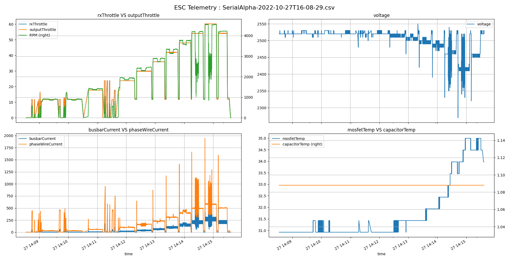
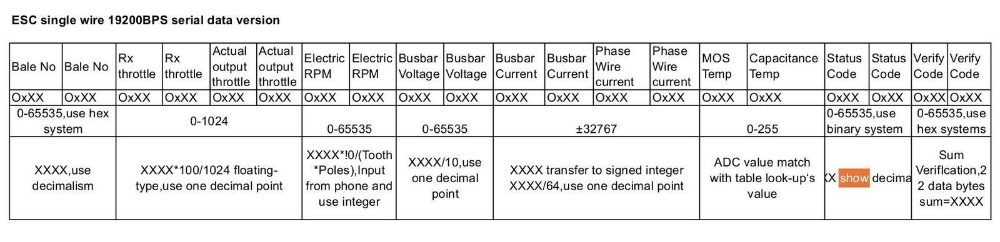

# T-Motor Alpha ESC Telemetry



Main source of information regarding this telemetry and the Alpha ESC series comes from the page :https://wiki.paparazziuav.org/wiki/Alpha_esc_with_telemetry_output

> ## About
>
> The page is about the T-Motor Alpha 60A LV 500Hz 4~6S ESC but apart from the type specifications can be referred to for all the Alpha ESC types.
>
> Well, please add more information if you come across some interesting facts...
>
> One of the facts is that the code is not in the master branch of Paparazzi yet, code is tested and still debugged as of 20180605. More robust error handling needs to be added and more in the field testing is the consensus.
> Manufacturer hype
>
> T-motor's ESC based on FOV (Sine Wave) with intelligent algorithm to satisfy the requirements of professional applications for efficient, accurate and stable motor control. Alpha series ESC's are more efficient compared to traditional ESC's using square wave driving and in combination with U series motor can achieve long flight times. Alpha Esc's features multiple protection system and its intelligent design enables to timely detect & adjust parameters such as low voltage, over current, throttle loss signal, motor lock and short circuit etc. thus prolonging the lifespan. Nano coating technology is adopted using IP55 Ingres Protection, making this ESC Anti corrosion, dust resistance and waterproof, thus allowing safe operation in any type of environments.
>
> Alpha series ESC's are revolutionary esc based on (FOV) using Sine wave algorithm to satisfy the requirements of professional applications for efficient, accurate and steady motor control. Lightweight compared to other esc's of same size using Ultra lite shell makes cooling efficient and contributes to lower temperature by 10%. Active braking functions allows recycle of energy allowing to recharge the battery when slowing down and increasing flight times.
>
> ## Features:
>
> - Adopt FOC (Sine wave technology) to adjust parameters
> - IP55 Ingress Protection against corrosion, dust & water
> - Efficient cooling using low weight housing
> - Multiple protection functions
> - Active braking function, recycle energy
> - 6S LiPo support with 40A continuous and 60A peak
> - Low Noise, Temperature and Interference
> - Fast Response, High Efficiency
> - Match U3 KV700, U5 KV400 , MN5212 KV340 , MN7005 KV230 Only
>
> ## Specifications:
>
> | Specification              | Value                                          |
> | :------------------------- | :--------------------------------------------- |
> | Input Voltage Min          | 18~25v (6s Lipo)                               |
> | Max Continuous Current     | 40A                                            |
> | Peak Current (10s)         | 60A                                            |
> | Idle Current               | <50mA                                          |
> | BEC                        | No                                             |
> | Throttle Pos. range        | 1100-1900µs                                    |
> | Throttle Refresh frequency | 500Hz Throttle Response speed 50ms             |
> | Size (LxWxH)               | 71.3x32.5x15.9mm                               |
> | Weight                     | 62.8g                                          |
> | Motor Cable                | 16AWG, 70mm x 3 (Silicone coated, Deep Orange) |
> | Power cable                | 14AWG, 175mm (Silicone wire Red/Black)         |
> | Signal cable               | PVC flat cable with JP 3P male connector       |
>
> ## FOC
>
> FOC: abbreviation of "field-oriented control" . The principle of FOC is to control motor output via the adjustment of current flow and angle, the features of which can be used to control motor magnetic field a. torque Current and voltage output of 3 phases is presented by vectors in mathematical model, that is why FOC is also known as "vector control" . An revolutionary ESC based on FOV (Sine wave) with intelligent algorithm to satisfy the requirements of professional applications for efficient, accurate and steady motor control.
>
> High Efficiency ALPHA ESCs are more efficient compared with traditional BLDG ESCs (square wave driving). Combo use with T-MOTOR U-series motors long flight time can be easily achieved.
>
> Stability Compared with traditional square wave driving, ALPHA ESC responses faster with less pu. current and steady startup. Sine Wave Drive {GRAPH} Current A (A) IT Thrust(g) Time (S) Data above are current change of throttle from 0% to 10096 within 0.1S Over-current Protection Short Circuit Protection Throttle Loss Protection
> Motor Lock-up Protection
>
> Lpr—orcttio"„e Multiple Protections Intelligent design enables ALPHA ESC to timely detect parameters as to voltage. current and temperature etc. ESC will carry out adjustment and interference upon abnormality. thus helps prolong the life span.
>
> Strict Protection Nano coating technology is adopted In ALPHA ESC PCB A. I P55 grade keep water and dust away Protect ESC from the damage of liquid corrosion for safe operation. Light-weight Design On the promise of waterproof, dust-resistance and cooling performance ALPHA ESC is 1 5-20% lighter than square wave E. of same size
>
> Efficient Cooling FOC driving without hybrid current reduces ESC temperature. Novel cooling design contributes to temperature drop by 1 0%+ ESC runs at ease at hot environment
> Active Braking
>
> With active braking function motor recycles energy when slowing down. With recycled energy motor charges the battery reversely for flight time extension.
>
> Recommendations
>
> ## ESC
>
> MOTOR U3-KV700 U5-KV400 ALPHA 40A LV MN5212-KV340 MN7005-KV230 MN60IS-KV320 ALPHA 60A LV MN605S-KV320 U8I1 / U81ite-KV150 / KV190 M701S-KV135 M705S-KV125 MN601S-KV170 ALPHA 60A HV MN605S-KV170 MN7005-KV115 U8-KV100 U8I1/ U81ite-KV85 P60-KV340 M705S-KV260 ALPHA 80A LV M701S-KV280 P80-KV170 P60 KV170 P80-KV100 P80-KV120 ALPHA 80A HV U13-KV100 U13-KV85 U12-KV 90 / KV 100 ALPHA 180A HV U15-KV80 / KV100 Volt. 16V 24V 24V 48V 24V 48V 48V
>
> Continuously updated
>
> Prop 12CF 16CF 18CF 24CF 21CF 22CF 28CF 24CF 27CF 21CF 22CF 24CF 28CF 30CF 22CF 27CF 24CF 29CF 22CF 32CF 29CF 30CF 32CF 30CF 40CF
>
> Product Drawing-ALPHA 60A 6S {ADD} basic parameter-ALPHA 60A 6S Size 71.3'32.51 5.9mm (L.W.H) Weight (Incl. cables) 62.8g Motor cable Silicone wire-deep orange-16AWG-70MM,PCS Power cable Silicone wire-red/black-14AWG175MM Signal cable PVC flat cable-30 core wires-2-355MM (white. blank. black/JP 3P male connector) Upgrade cable PVC flat cable-30 core wires-3-50MM (black. red. white/JP 3P male connector)
>
> ## Telemetry
>
> A module surprisingly called "Alpha ESC" is available to read the data. Read the documentation via Doxygen or a bit, maybe outdated information here on this page...
>
> The Black and White cable is regular servo connector with PWM to control ESC speed output
> Yellow cable give pulses for fast RPM measurement
> The black, Red and White cable sends a serial data stream. Connect Black to GND and White cable must be connected to a serial RX port on the autopilot. Disconnect the red wire
>
> ## Data format for PaparazziUAV configuration
>
> 
>
> ```xml
>   <message name= "ALPHA_ESC" id = "45">
>     <description>Live data consisting of various Alpha ESC output values</description>
>     <field name = "bale_no" type="uint16" unit="pprz"/>
>     <field name = "rx_throttle" type="uint16" unit="pprz"/>
>     <field name = "output_throttle" type="uint16" unit="pprz"/>
>     <field name = "rpm" type="uint16" unit="rpm"/>
>     <field name = "voltage" type="uint16" unit="1e1V" alt_unit="V"  alt_unit_coef="0.1"/>
>     <field name = "busbar_current" type="int16" unit="64A" alt_unit="A" alt_unit_coef = "0.015625"/>
>     <field name = "phase_wire_current" type="int16" unit="64A" alt_unit="A" alt_unit_coef = "0.015625"/>
>     <field name="capacitor_temp"      type="uint8" unit="dC"/>
>     <field name="mosfet_temp"      type="uint8" unit="dC"/>
>     <field name="status_code"   type="uint16" unit="pprz"/>
>     <field name="verify_code"   type="uint16" unit="pprz"/>
>   </message>
> ```
