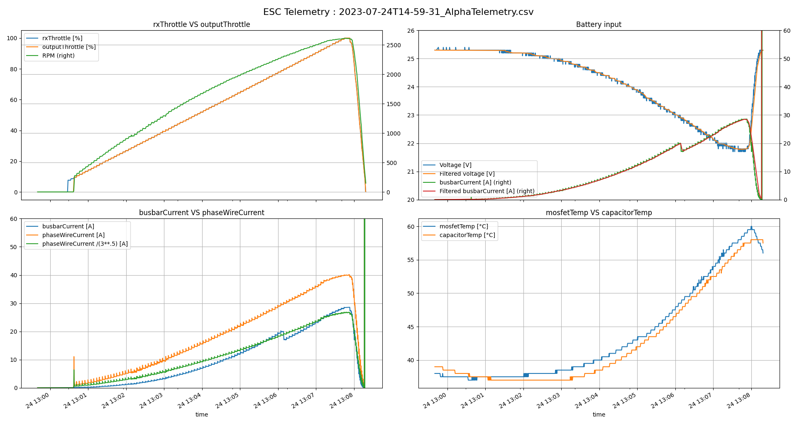
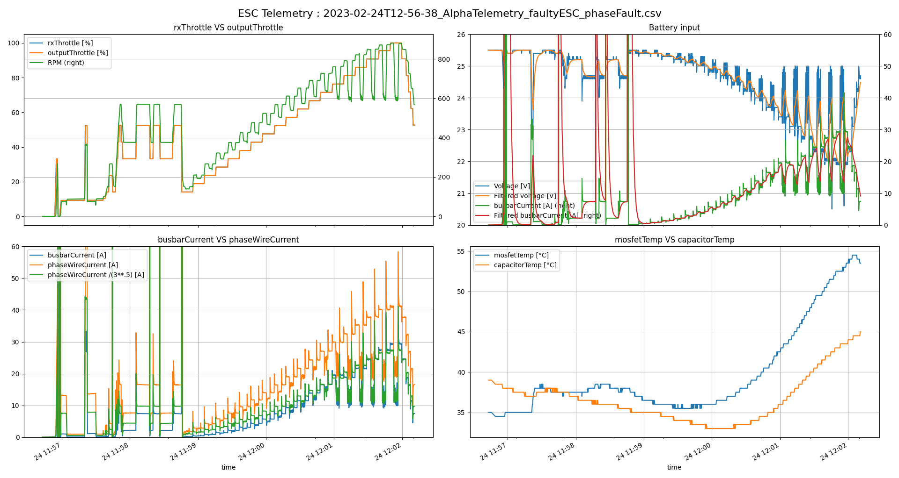

# T-Motor Alpha ESC Telemetry

Python library to read, analyse and replay telemetry data from T-Motor Alpha ESCs.

Main source of information regarding this telemetry and the Alpha ESC series comes from the page:
https://wiki.paparazziuav.org/wiki/Alpha_esc_with_telemetry_output

## Installation

As a python package:

```bash
cd /path/to/this/repo
pip install -e .
```

Then you can import the `AlphaESCTelemetry` package in your python scripts.

```python
import AlphaESCTelemetry
```

Or you can run the scripts directly from the command line.

```bash
cd /path/to/this/repo/AlphaESCTelemetry
python captureESCTelemetry.py [POLES_N (default=21)]
```

## Usage

List of scripts available in the `AlphaESCTelemetry` folder installed by this package:

1. `alphaTelemetry.py`: Main class for telemetry data processing.
2. `captureESCTelemetry.py`: Script to capture telemetry data from a serial port and save it to both a BIN and CSV file.
3. `decodeESCTelemetry.py`: Script to decode an existing binary files containing raw telemetry packets captured from an Alpha T-Motor ESC.
4. `plot_csv_telemetry.py`: Script to load a CSV file containing telemetry data and plot it (examples shown in the `Output` section).
5. `replay_telemetry.py`: Script to load a BIN file containing telemetry data and replay it over serial port to avoid having to connect an ESC to a device to test the decoding.
6. (Deprecated) `serial_ESC_Alpha_to_csv.py`: Script to convert a BIN file containing telemetry data to a CSV file.

## Output




